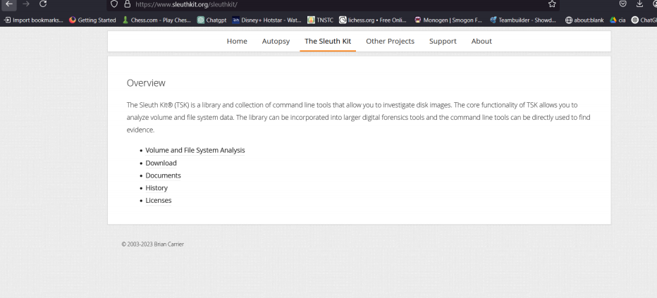

# Simulating the Forensics Lab Basics
```
Name : Aakashraj M
Reg.no : 212222100002
```
## Aim :
   To install VirtualBox and set up a virtual machine(Kali Linux), install Autopsy and Sleuth Kit, and use them for forensic investigation by analyzing disk storage and file system.

## **Implementation Steps :**

### **Step 1: Install VirtualBox**
🔗 **Download VirtualBox**: [click here](https://virtualbox.en.softonic.com/)  

### **Installation Steps:**
1. Download the **Windows hosts** `.exe` file from the official VirtualBox website.  
2. Run the installer and follow the on-screen instructions.  
3. Once installed, launch VirtualBox to verify the installation.


### **Step 2: Install Kali Linux on VirtualBox**
🔗 **Download Kali Linux VM**: [Click Here](https://www.kali.org/get-kali/#kali-virtual-machines)  

### **Installation Steps:**
1. Download the Kali Linux ISO file.Open VirtualBox, click New, enter "Kali Linux", select Type: Linux and Version: Debian (64-bit).  
2. Set RAM to at least 4GB ,Set disk storage to at least 30GB, choose Dynamically Allocated or Fixed Size, and create the VM. 
3. Go to Settings > Storage, click Empty under Controller: IDE. 
4. Select Graphical Install, follow the prompts to set language, location, username, and password.
5. Choose Partitioning Method (Guided - Use Entire Disk) and wait for installation to complete.


### **Step 3: Install Autopsy (GUI-based Forensic Tool)**
🔗 **Download Autopsy**: [Click Here](https://www.autopsy.com/download/)  

### **Installation Steps:**
1. Download the **Autopsy Windows Installer** from the official website.  
2. Extract the ZIP file and open the **bin** folder.  
3. Run `autopsy.exe` and set up a new forensic case for analysis.


### **Step 4: Install Sleuth Kit (CLI-based Forensic Tools)**
🔗 **Download Sleuth Kit**: [Click Here](https://sleuthkit.org/download.php)  

### **Installation Steps:**
1. Download the **Windows ZIP package** from the official website.  
2. Extract the ZIP folder and move it to a suitable directory (e.g., `C:\sleuthkit`).  
3. Add the **bin folder** to Windows PATH:
   - Open **Control Panel** → **System** → **Advanced System Settings**.  
   - Click **Environment Variables** → Edit **Path**.  
   - Add the Sleuth Kit `bin` folder path and save changes.  
4. Verify installation by running:
   ```sh
   fls -version


### **Step 5: Create & Configure a Virtual Hard Disk (VHD) in Windows**

1. Press **Win + X**, Select Disk Management.
2. Click Action > Create **VHD**.
3. Choose a location and set a disk size (e.g., 10GB+).
4. Select Fixed Size or Dynamically Expanding and click OK.
5. In Disk Management, find your new disk (marked as "Not Initialized") -> Right-click the new disk → Initialize Disk → Select **MBR**.
6. Right-click Unallocated Space → **New Simple Volume** → Format the disk -> Click next → Finish.

---

## Output:

### **Virtual Box:**


---

### **Virtual Machine (Kali Linux)**


---

### **Autopsy**


---

### **Sleuth Kit**




---

### **Creation of Virtual Hard Disk**


---

## Result :
The installation of VirtualBox, Autopsy, and Sleuth Kit, along with the setup of Kali Linux - Virtual Machine and the creation of a new virtual disk, has been successfully completed.
